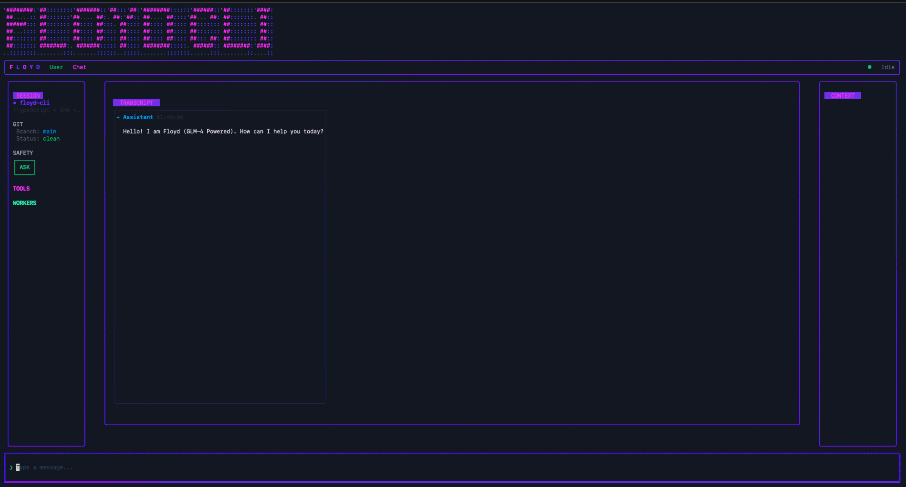

# ***~Floyd Code CLI~***



**The Original. The One That Started It All.**

*85% as good as the fancy guys. 1/10th the price. Do the math.*

https://github.com/CaptainPhantasy/Floyd-Code-CLI

---

## What Is This?

Back before we had a whole ecosystem, before there was a Desktop app and a Chrome extension and an IDE in development... there was this.

A CLI tool. Living in your terminal. Helping you code. Powered by **GLM-4.7** — a model that's surprisingly good considering how little it costs.

Think of it as "that popular AI coding tool" if it grew a conscience and stopped charging you rent.

---

## The GLM-4.7 Secret

Here's the thing about GLM-4.7: it's not the *best* model out there. We'll be honest — it's maybe 85% there.

But here's where it gets interesting:

```
┌────────────────┬────────────────────────────┐
│ The Other Guys │         Floyd CLI          │
├────────────────┼────────────────────────────┤
│   $20/month    │         ~$2/month          │
├────────────────┼────────────────────────────┤
│  Rate limits   │      What are those?       │
├────────────────┼────────────────────────────┤
│ Walled garden  │     Open pasture, baby     │
├────────────────┼────────────────────────────┤
│ Fancy wrapper  │ Just a really good wrapper │
└────────────────┴────────────────────────────┘
```

**85% of the quality for 10% of the cost.** Your wallet does the rest of the math.

---

## What Floyd CLI Can Do

- **Read your code**: Understands your project structure, finds files, doesn't ask where stuff is
- **Edit your code**: Surgical changes — fixes bugs without rewriting everything
- **Explain your code**: Tells you what that one function does (you know the one)
- **Write your code**: Generates new code, refactors old code, pretends it knows what it's doing
- **Remember your code**: SUPERCACHING™ keeps context so you don't repeat yourself

---

## Quick Start

```bash
# Clone the OG
git clone https://github.com/CaptainPhantasy/Floyd-Code-CLI.git
cd FLOYD_CLI/INK/floyd-cli

# Install the thing
npm install
npm run build
npm link

# Run the thing
floyd-cli
```

---

## Configuration

Floyd CLI likes a GLM-4.7 API key. They're cheap. We'll wait.

```env
# Get your key from wherever fine API keys are sold
GLM_API_KEY=your_key_here

# Or use one of these fallbacks (Floyd checks in order):
# ANTHROPIC_AUTH_TOKEN
# OPENAI_API_KEY
# ZHIPU_API_KEY
```

---

## SUPERCACHING™

Floyd remembers stuff. Three tiers of memory:

```
┌───────────┬───────────┬──────────────────────────────┐
│   Tier    │ How Long  │        What It's For         │
├───────────┼───────────┼──────────────────────────────┤
│ Reasoning │ 5 minutes │ Active conversation context  │
├───────────┼───────────┼──────────────────────────────┤
│  Project  │ 24 hours  │ Current project work         │
├───────────┼───────────┼──────────────────────────────┤
│   Vault   │ 7 days    │ Reusable patterns & snippets │
└───────────┴───────────┴──────────────────────────────┘
```

This means Floyd doesn't make you re-explain your whole life story every time you ask a follow-up question. Shine on you crazy diamond.

---

## Keyboard Shortcuts

Because clicking is for people who don't know shortcuts exist.

```
┌──────────────┬───────────────────────────────────────┐
│   Shortcut   │             What Happens              │
├──────────────┼───────────────────────────────────────┤
│ Ctrl+Shift+P │ Open Prompt Library                   │
├──────────────┼───────────────────────────────────────┤
│ Ctrl+P       │ Command Palette                       │
├──────────────┼───────────────────────────────────────┤
│ Ctrl+M       │ Monitor Dashboard (watch Floyd think) │
├──────────────┼───────────────────────────────────────┤
│ Ctrl+Z       │ **Zen Mode** — UI vanishes. Pure code.│
├──────────────┼───────────────────────────────────────┤
│ ?            │ Help overlay                          │
└──────────────┴───────────────────────────────────────┘
```

---

## Commands

```bash
floyd-cli              # Start the interactive CLI
floyd-cli --help       # Show all commands
floyd-cli --tmux       # Dual-screen mode (fancy)
floyd-cli --monitor    # Monitor dashboard only
floyd-cli --config     # Configuration UI
```

---

## How It Compares

```
┌──────────────┬────────────┬────────────┐
│   Feature    │    Them    │     Us     │
├──────────────┼────────────┼────────────┤
│ Code quality │   ★★★★★   │   ★★★★✨   │
├──────────────┼────────────┼────────────┤
│ Price        │ 💸💸💸💸💸 │ 💸         │
├──────────────┼────────────┼────────────┤
│ Rate limits  │ 😤         │ 🏃 (none)  │
├──────────────┼────────────┼────────────┤
│ Attitude     │ Corporate  │ Handsome?  │
├──────────────┼────────────┼────────────┤
│ Zen Mode     │ ❌         │ ✅         │
└──────────────┴────────────┴────────────┘
```

*✨ = "Honestly can you tell the difference half the time?"*

---

## Requirements

- Node.js 18+
- A GLM-4.7 API key (or compatible)
- A sense of humor (optional but recommended)
- A project you want help with (required)

---

## Troubleshooting

**Floyd won't start:**
```bash
npm run build
```

**Floyd's acting weird:**
```bash
rm -rf ~/.floyd/cache/
```

**Floyd's hallucinating:**
That's just what LLMs do sometimes. Say "thank you" and move on. Or try again. Or take a break. Floyd's not perfect, but neither are you, and we still let *you* write code.

---

## The Fine Print

Floyd CLI is an experimental tool from **Legacy AI**. It might write amazing code. It might write nonsense. It might insult your variable names (rude, but fair).

Use at your own risk. Commit often. Keep backups. And remember: 85% of perfect for 10% of the price is still a hell of a deal son.

---

## Version History

- **v0.1.0** (2026-01-20) — The beginning. SUPERCACHING, MCP, terminal UI.
- **v0.1.5** (2026-01-21) — Various fixes. Still cheap.
- **v0.2.0** — Coming soon. Even cheaper. (Okay, same price. Just better.)

---

*Made with ❤️, caffeine, and a refusal to pay $20/month by Legacy AI in Brown County, Indiana.*

*© 2026 Legacy AI – The little SaaS shop that could.*
