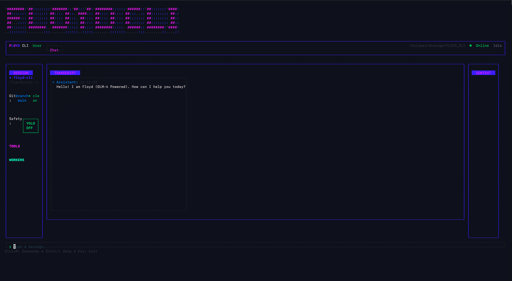

<p align="center">
  
</p>

# FLOYD CLI

**File-Logged Orchestrator Yielding Deliverables**

> *Because paying $20/month for an AI coding assistant is for people who hate money.*

<p align="center">
  
</p>

FLOYD is a GLM-4.7 powered coding agent that does everything that *other* AI coding assistants do — except it runs in your terminal and costs approximately 1/100th the price. We would name the competition, but our lawyers advised against it.

## What is FLOYD?

FLOYD is your personal coding accomplice that:
- Reads and writes code (sometimes even correct code!)
- Runs commands and tools (destructively, if you're not careful)
- Remembers context across sessions via FLOYD-S SUPERCACHE™
- Uses your existing GLM API key instead of demanding a kidney
- Looks absolutely stunning in your terminal — OR in a desktop app!

### Multiple Interfaces

FLOYD comes in different flavors for different moods:

| Interface | Description | Status |
|-----------|-------------|--------|
| **Ink CLI** | Terminal-based TUI (React Ink) | ✅ Complete |
| **FloydDesktop** | Electron desktop app with proper GUI | 🚧 In Progress |
| **FloydChrome** | Browser extension for web automation | ✅ Built |
| **Go CLI** | Legacy Go-based version (DEPRECATED - use TypeScript CLI) | ✅ Complete |

## Installation

```bash
# Clone the repo
git clone https://github.com/CaptainPhantasy/Floyd-CLI.git
cd Floyd-CLI/INK/floyd-cli

# Install dependencies
npm install

# Build
npm run build

# Run
npm start
```

## Configuration

FLOYD needs an API key to function. It checks:
1. `GLM_API_KEY` environment variable
2. `ZHIPU_API_KEY` environment variable
3. Its own internal sense of entitlement (not recommended)

No API key? FLOYD will sit there and judge you silently.

## Usage

### Terminal (Ink CLI)

```bash
cd INK/floyd-cli
npm start
```

### Desktop App (FloydDesktop)

```bash
cd FloydDesktop
npm install
npm run dev        # Development mode
npm run package    # Create distributable
```

### Chrome Extension

```bash
cd FloydChromeBuild/floydchrome
npm install
# Load as unpacked extension in Chrome
```

### Go CLI (Legacy)

> **⚠️ DEPRECATED:** The Go-based CLI is archived. Use the TypeScript Ink CLI instead.

```bash
go build -o floyd ./cmd/floyd
./floyd
```

---

FLOYD will greet you with a stunning ASCII banner (or a shiny GUI window, if you're fancy).
Then you type things and FLOYD types back.
It's conversational! Revolutionary!

## Commands

| Command | Description |
|---------|-------------|
| `floyd-cli` | Start interactive CLI |
| `floyd-cli --config` | Launch configuration interface |
| `floyd-cli --monitor` | Launch monitor dashboard |
| `floyd-cli --tmux` | Launch dual-screen TMUX mode |
| Type anything | FLOYD will attempt to help |
| Esc | Escape the existential dread |
| ? | Toggle help (when you're hopelessly lost) |

### Configuration Interface

FLOYD includes a comprehensive configuration interface for:
- **Monitor Config** - File watchers, MCP servers, monitoring toggles
- **Agent Manager** - Create and configure agent profiles
- **Prompt Library** - Manage prompt templates

See [Configuration Interface User Manual](docs/CONFIG_INTERFACE_USER_MANUAL.md) for complete documentation.

## FLOYD-S SUPERCACHE™

FLOYD remembers stuff. Three tiers of memory:

| Tier | Purpose | TTL |
|------|---------|-----|
| `reasoning` | Current conversation | 5 min |
| `project` | Project context | 24 hours |
| `vault` | Reusable wisdom | 7 days |

*Patent pending. Probably.*

## Available Tools

FLOYD can do things to your files:
- `bash` - Execute arbitrary commands (what could go wrong?)
- `read` - Read files (spying on your code)
- `write` - Write files (creating new problems)
- `edit` - Edit files (surgical strikes on bugs)
- `multiedit` - Multiple edits (chaos at scale)
- `grep` - Search (find what you're looking for)
- `ls` - List directories (see what's there)

## Project Structure

```
FLOYD_CLI/
├── packages/
│   └── floyd-agent-core/   # Shared TypeScript agent core
├── INK/
│   └── floyd-cli/          # Terminal CLI (React Ink)
├── FloydDesktop/           # Electron desktop app 🚧
│   ├── electron/           # Main process
│   ├── src/                # React UI
│   └── IMPLEMENTATION.md   # Build guide
├── FloydChromeBuild/       # Chrome extension
│   └── floydchrome/
│       ├── mcp/             # MCP server
│       ├── tools/           # Browser automation
│       └── native-messaging/ # Host bridge
├── agent/                   # ⚠️ Legacy Go code - archived, use TypeScript version
├── tui/                     # ⚠️ Legacy Go code - archived, use TypeScript version
└── docs/                    # Documentation
```

**Note:** The Go-based agent is legacy. New development focuses on the TypeScript shared core that powers both CLI and Desktop.

## Status

- ✅ TypeScript migration complete — Go code archived to `.archive/2026-01-16-go-tui-retirement/`
- ✅ Ink CLI (Terminal TUI) fully functional
- ✅ Shared `packages/floyd-agent-core/` powers CLI and Desktop
- ✅ MCP client working
- ✅ Session persistence
- ✅ Chrome extension bridge
- ✅ ASCII banner looks fly
- 🚧 FloydDesktop (Electron app) in development
- ⏳ World domination (in progress)

## Quick Test

```bash
# Terminal version
cd INK/floyd-cli
npm install
npm run build
npm start

# Desktop version (if you like windows)
cd FloydDesktop
npm install
npm run dev

# Expected: A stunning interface appears
# Unexpected: Nothing, because you forgot to set GLM_API_KEY
```

## Troubleshooting

**Q: FLOYD isn't responding**
A: Did you set `GLM_API_KEY`? FLOYD can't read minds.

**Q: The build failed**
A: Did you run `npm install`? Did you update Node.js since 2019?

**Q: Why isn't this as good as [REDACTED]?**
A: It costs 1/100th the price. You get what you pay for. But hey, it's open source!

## Security

**⚠️ NEVER COMMIT API KEYS OR SECRETS**

This repository uses `.gitignore` to prevent accidental commits of sensitive files. The following are explicitly ignored:

- `INK/floyd-cli/.env` - Environment files with API keys
- `scripts/verify-ipc-flow.ts` - Verification scripts with test keys
- `scripts/verify-connection.ts` - Connection test scripts

**Rules:**
1. Always use environment variables for API keys (`GLM_API_KEY`, `ANTHROPIC_AUTH_TOKEN`)
2. Never hardcode keys in source files
3. If you accidentally commit a key, **revoke it immediately** from your provider
4. Use placeholder values like `sk-placeholder` in test code

**To configure your API key safely:**
```bash
# Set as environment variable (recommended)
export GLM_API_KEY=your-key-here

# Or create a local .env file (already gitignored)
echo "GLM_API_KEY=your-key-here" > INK/floyd-cli/.env
```

## License

MIT - do whatever you want. Fork it, improve it, sell it, set it on fire.

## Acknowledgments

- Built with [Ink](https://github.com/vadimdemedes/ink) (React for CLIs, mind = blown)
- Powered by [GLM-4.7](https://open.bigmodel.cn/) (the unsung hero)
- Inspired by *certain* AI coding tools that shall remain nameless
- ASCII art generated with questionable taste
