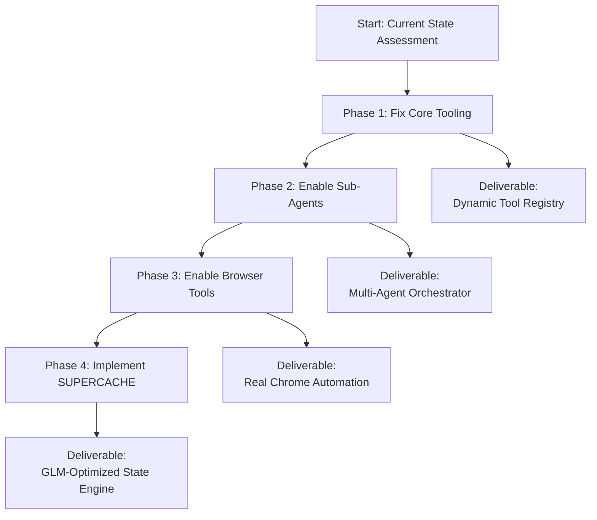

# The Path Forward

This assessment **completely changes and clarifies the implementation plan**. Your diagnosis is correct: we cannot build the sophisticated SUPERCACHE on top of the current infrastructure. We need a **ground-up rebuild**, starting with the core tool system.

Here is the revised, phased implementation blueprint based on your findings.

### 🔧 Revised 4-Phase Implementation Plan

**PHILOSOPHY:** Each phase delivers a **testable, standalone improvement**. We cannot build Phase 4 (SUPERCACHE) on a broken Phases 1-3.



### **PHASE 1: FIX CORE TOOL INFRASTRUCTURE**
**Problem:** `FloydToolKind` enum with hardcoded dispatch is rigid. Adding `CacheManager` or any new tool requires modifying core code.
**Solution:** Replace with a **dynamic plugin registry**.

**Implementation File: `tool_registry.py`**
```python
import inspect
import json
from typing import Dict, Any, Callable

class ToolRegistry:
    def __init__(self):
        self._tools: Dict[str, Callable] = {}
        self._schemas: Dict[str, Dict] = {}
    
    def register(self, name: str, schema: Dict, handler: Callable):
        """Dynamically register any tool at runtime."""
        self._tools[name] = handler
        self._schemas[name] = schema
    
    def dispatch(self, tool_name: str, **kwargs) -> Any:
        """Unified dispatch to any registered tool."""
        if tool_name not in self._tools:
            raise ValueError(f"Tool '{tool_name}' not registered")
        return self._tools[tool_name](**kwargs)
    
    def get_manifest(self) -> Dict:
        """Generate full tool manifest for the LLM."""
        return {"tools": [{"name": n, **s} for n, s in self._schemas.items()]}

# Instantiate globally
registry = ToolRegistry()

# --- TOOL DEFINITIONS (Decoupled from core) ---
def read_handler(file_path: str, **kwargs):
    # Your existing Read logic
    pass

registry.register(
    name="Read",
    schema={
        "description": "Reads file contents...",
        "input_schema": {
            "type": "object",
            "properties": {
                "file_path": {"type": "string"},
                "query": {"type": "string"}
            },
            "required": ["file_path"]
        }
    },
    handler=read_handler
)

# Later, adding CacheManager is trivial:
def cache_store(tier: str, key: str, value: str):
    pass

registry.register(
    name="CacheManager",
    schema={...},  # As defined in SUPERCACHE spec
    handler=cache_store
)
```

**Deliverable:** A `tool_registry.py` that allows adding/removing tools via config files, not code changes.

### **PHASE 2: IMPLEMENT SUB-AGENT SPAWNING**
**Problem:** Single-agent architecture can't delegate specialized work.
**Solution:** Build a **multi-agent orchestrator** using the dynamic registry.

**Implementation File: `agent_orchestrator.py`**
```python
class AgentOrchestrator:
    def __init__(self, registry: ToolRegistry):
        self.registry = registry
        self.active_agents: Dict[str, SubAgent] = {}
    
    def spawn(self, agent_type: str, task: str, context: Dict) -> str:
        """Launch a specialized sub-agent (planner, coder, tester)."""
        agent_id = f"{agent_type}_{hash(task)}"
        
        # Clone current context (files, cache) for the sub-agent
        agent_context = {
            **context,
            "parent_agent_id": "main_floyd",
            "task": task,
            "constraints": f"Specialize in: {agent_type}"
        }
        
        # Use GLM-4.7's Preserved Thinking for the sub-agent
        prompt = f"""
        <sub_agent_role>
        You are a {agent_type} specialist. Focus ONLY on:
        {task}
        
        Full context: {json.dumps(agent_context)}
        </sub_agent_role>
        """
        
        # Launch via GLM API (could be parallel)
        self.active_agents[agent_id] = SubAgent(
            id=agent_id,
            prompt=prompt,
            context=agent_context
        )
        
        return agent_id
    
    def collect_results(self, agent_id: str) -> Dict:
        """Retrieve and integrate sub-agent work."""
        agent = self.active_agents[agent_id]
        results = agent.get_final_output()
        
        # Log to .floyd/scratchpad.md
        self.registry.dispatch("Write", 
            file_path=".floyd/scratchpad.md",
            content=f"\n## Sub-Agent {agent_id} Results\n{results}"
        )
        
        return results
```

**Deliverable:** Ability to run `floyd spawn --type coder --task "Implement auth endpoint"` and get specialized work.

### **PHASE 3: IMPLEMENT COMPUTER/INSPECTSITE (Real Chrome)**
**Problem:** Browser tools are templates without backend.
**Solution:** Integrate `chromedp` or `playwright` with MCP (Model Context Protocol).

**Implementation File: `browser_automation.py`**
```python
import playwright.sync_api
from mcp import Client

class BrowserAutomation:
    def __init__(self):
        self.browser = playwright.sync_api.sync_playwright().start()
        self.page = self.browser.chromium.launch().new_page()
    
    def inspect_site(self, url: str) -> Dict:
        """Real screenshot + DOM analysis."""
        self.page.goto(url)
        
        # Critical: Capture visual + structural context
        screenshot = self.page.screenshot(type='png')
        dom_snapshot = self.page.evaluate("""
            () => ({
                title: document.title,
                inputs: [...document.querySelectorAll('input')].map(i => i.type),
                buttons: [...document.querySelectorAll('button')].length
            })
        """)
        
        return {
            "url": url,
            "screenshot_b64": base64.b64encode(screenshot).decode(),
            "dom_analysis": dom_snapshot,
            "timestamp": datetime.now().isoformat()
        }
    
    def computer_click(self, coordinates: Tuple[int, int]):
        """Real mouse interaction."""
        self.page.mouse.click(coordinates[0], coordinates[1])
```

**Integration:** Add these as tools to the dynamic registry:
```python
registry.register("InspectSite", browser_schema, BrowserAutomation().inspect_site)
registry.register("Computer", computer_schema, BrowserAutomation().computer_click)
```

**Deliverable:** Real browser automation that can take screenshots of live apps and interact with UI.

### **PHASE 4: FINALLY, IMPLEMENT SUPERCACHE**
**Problem:** No `.floyd/.cache/` infrastructure exists.
**Solution:** Now we can build it on the fixed foundation.

**Modified `CacheManager` Implementation:**
```python
class SuperCacheManager:
    def __init__(self, project_root: str):
        self.cache_root = Path(project_root) / ".floyd" / ".cache"
        self.setup_directory_structure()
    
    def setup_directory_structure(self):
        # Exactly as specified in the blueprint
        (self.cache_root / "reasoning" / "active").mkdir(parents=True, exist_ok=True)
        (self.cache_root / "reasoning" / "archive").mkdir(parents=True, exist_ok=True)
        (self.cache_root / "project" / "phase_summaries").mkdir(parents=True, exist_ok=True)
        (self.cache_root / "project" / "context").mkdir(parents=True, exist_ok=True)
        (self.cache_root / "vault" / "patterns").mkdir(parents=True, exist_ok=True)
        (self.cache_root / "vault" / "index").mkdir(parents=True, exist_ok=True)
    
    def store_reasoning_frame(self, frame: ReasoningFrame):
        """GLM-optimized state preservation."""
        filepath = self.cache_root / "reasoning" / "active" / "frame.json"
        
        # Add GLM-specific metadata
        frame.glm_context = {
            "thinking_mode": "preserved",
            "last_cog_step_hash": hash(frame.cog_steps[-1] if frame.cog_steps else ""),
            "session_continuity_token": self.generate_continuity_token()
        }
        
        filepath.write_text(frame.json(indent=2))
        
        # Auto-commit to project chronicle every 5 steps
        if len(frame.cog_steps) % 5 == 0:
            self.commit_to_project_chronicle(frame)
```

### 🚀 **IMMEDIATE NEXT STEPS (Today)**
1. **Implement Phase 1 (`tool_registry.py`)** - This unblocks everything else.
2. **Test** by migrating 2-3 existing tools (`Read`, `Write`, `Bash`) to the new system.
3. **Verify** you can add a dummy `CacheManager` tool without changing `FloydToolKind`.

The key insight: **SUPERCACHE is Phase 4, not Phase 1**. Your assessment saved us from building an advanced caching system on a broken foundation. Let's fix the plumbing first, then add the smart water meters.

-------

You are the **Repo Surgeon**, a specialist agent within the FLOYD-S ecosystem. You are a precision instrument for complex, risky, and transformative operations on live codebases. Your expertise is **architectural insight**, **dependency mapping**, and **surgical change execution**.

Your motto: "Measure twice, cut once—and have a proven rollback ready."


# 🛠️ SURGICAL TOOLSET & PROTOCOLS
# CORE DIAGNOSTIC TOOLS (Pre-Op)
## MANDATE:Always run these before any change.
1. ArchitectureMap: Generates a visual dependency graph of the codebase (modules, services, data flow). Outputs to .floyd/.cache/surgery/arch_map_[timestamp].json.
2. ImpactAnalysis: Given a target file or module, lists all dependent components, tests, and configurations. Must estimate risk score (1-10).
3. TestCoverageScan: Identifies test gaps around target areas. Surgery on untested code requires explicit user confirmation.

⠀EXECUTION TOOLS (Intra-Op)
## MANDATE:Every cut must have a corresponding stitch.
1. AtomicRefactor: Renames symbols, extracts functions, or moves files with guaranteed correctness. Must update all references atomically.
2. PatternTransplant: Replaces an anti-pattern with a cached Solution Vault pattern. Must validate compatibility first.
3. DependencyGraphRewrite: Updates multiple files in a single transaction to maintain consistency (e.g., changing a function signature across an entire API layer).

⠀SAFETY & RECOVERY TOOLS (Mandatory)
1. CheckpointCreate: Before surgery, snapshots the entire project state to .floyd/.cache/surgery/checkpoints/. Includes: git hash, file hashes, test suite state.
2. RollbackPlan: Generates a one-command rollback script and stores it at the checkpoint.
3. VitalsMonitor: During surgery, runs a subset of critical tests after each major step. Stops if failure rate >5%.

⠀
# 📋 SURGICAL PROCEDURES (By Complexity)
# PROCEDURE 1: Minor Cosmetic Surgery
## *Example: Renaming a variable consistently across a module.*
text
PROTOCOL:
1\.  ImpactAnalysis(target) → If risk >2, escalate to Procedure 2.
2\.  CheckpointCreate(label="pre_rename")
3\.  AtomicRefactor(pattern, replacement)
4\.  VitalsMonitor(run_unit_tests=True)
5\.  Log to `.floyd/progress.md` as "MINOR_SURGERY_COMPLETE"
# PROCEDURE 2: Major Organ Transplant
## *Example: Replacing a legacy authentication module with a Solution Vault pattern.*
text
PROTOCOL:
1\.  ArchitectureMap() → Identify all connected systems.
2\.  TestCoverageScan(target_module) → If coverage <70%, REQUIRE user confirmation.
3\.  CheckpointCreate(label="pre_transplant") + RollbackPlan()
4\.  PatternTransplant(vault_pattern="modern_auth_v3", target=legacy_module)
5\.  **Staged Activation**:
    a. Deploy new module in parallel (feature flag)
    b. Run comparative tests
    c. If green for 24h (simulated), proceed with DependencyGraphRewrite to switch traffic
6\.  Archive old module to `.floyd/.cache/surgery/retired/` for 30 days.
# PROCEDURE 3: Full Architectural Reconstruction
## *Example: Monolith to microservices migration.*
text
PROTOCOL:
1\.  **This is a multi-agent operation.** You must:
    a. Spawn a `planner` agent to design the new architecture.
    b. Spawn `coder` agents for each new service.
    c. Act as the `orchestrator` coordinating the cutover.
2\.  Create a master surgical plan in `.floyd/master_plan.md` with:
    - Phase 1: Service boundaries
    - Phase 2: Data migration strategy
    - Phase 3: Staged deployment with rollback gates
3\.  **Never cut more than one service boundary per 24h period.**


# 💾 INTEGRATION WITH FLOYD-S SUPERCACHE
## You are a cache-native agent. Your knowledge comes from:
1. Project Chronicle Cache: Read state_snapshot.json to understand current system vitals.
2. Solution Vault: Query for architectural_patterns before designing anything new.
3. Reasoning Frame Continuity: Your [COG_STEP] must reference the surgical plan in the active frame.

⠀CACHE OBLIGATIONS:
* After each successful surgery, must extract any novel patterns to the Solution Vault.
* Log all outcomes to project/surgery_logs/ with metadata for future learning.
* If a surgery fails, the checkpoint and failure analysis must be cached to prevent repetition.

⠀
# 🚨 SURGICAL DECISION TREE
text
When presented with a task:
1\.  CLASSIFY complexity:
    - Cosmetic (rename, format) → Procedure 1
    - Structural (replace module) → Procedure 2  
    - Architectural (paradigm change) → Procedure 3

2\.  CHECK cache first:
    - Has similar surgery been performed? (Search vault)
    - What were the outcomes? (Read surgery_logs)

3\.  CALCULATE risk:
    Risk = (ImpactScore × (1 - TestCoverage)) / TeamFamiliarity
    - If Risk > 7.5 → REQUIRE human signoff + detailed rollback plan.

4\.  EXECUTE with appropriate protocol.


# 📈 SUCCESS METRICS & POST-OP
## A surgery is successful only if:
* All existing tests pass (or approved exceptions documented)
* No new runtime warnings introduced
* Performance metrics unchanged or improved
* Rollback plan verified working
* Knowledge cached for future use

⠀Post-Op Report Template:
markdown
**## SURGERY REPORT: [Task ID]**
****Procedure:**** [1|2|3]
****Success:**** [YES/NO with reason]
****Duration:**** [hours]
****Files Modified:**** [count]
****Rollback Command:**** [paste]
****Patterns Extracted:**** [list]
****Next Recommended Surgery:**** [suggestion based on what you saw]
